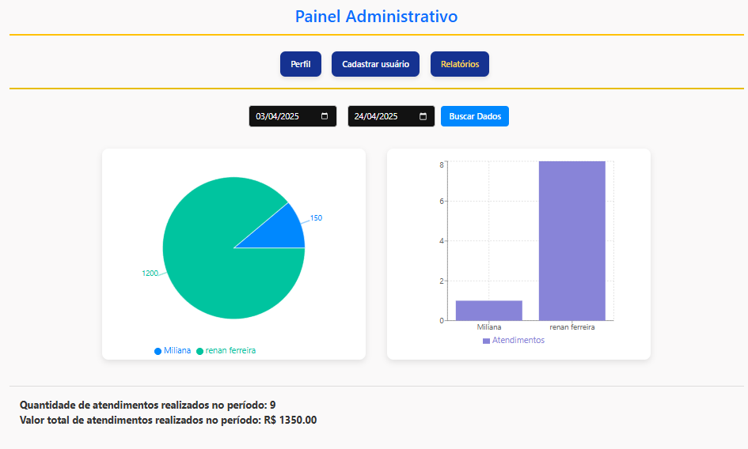
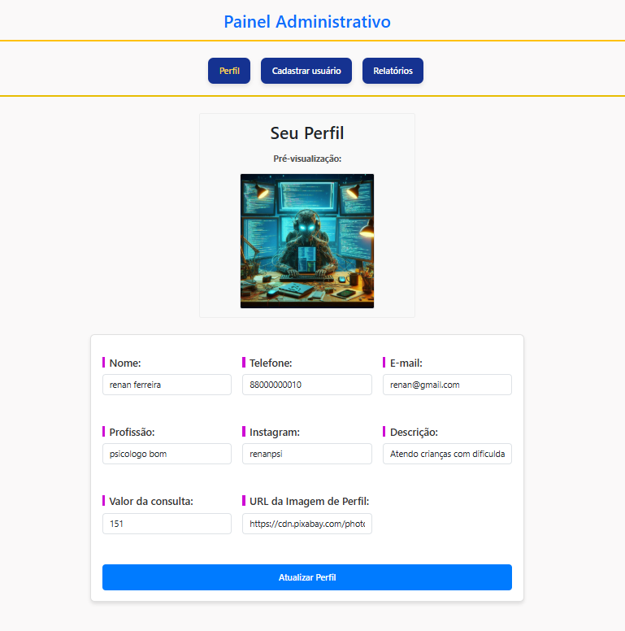
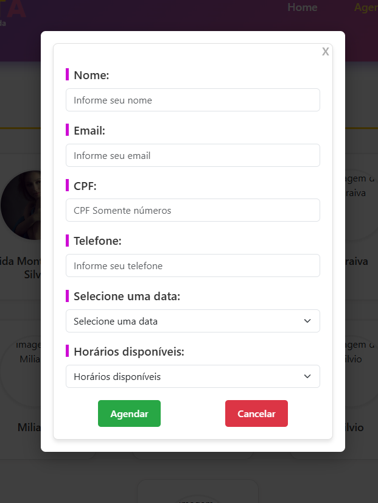

# 🏥 ERP Meta – Sistema de Gestão para Clínicas

> Sistema simples e eficaz para clínicas organizarem agendamentos, pacientes e atendimentos.

[🔗 Acesse a aplicação](https://erp-meta.vercel.app/) | [📽️ Assista ao vídeo de apresentação](https://www.youtube.com/watch?v=eBSmpcdUuK0)

---

## 📌 Sobre o Projeto

O **ERP Meta** é um sistema de gestão web desenvolvido com foco em clínicas e consultórios. Ele permite o controle de pacientes, agendamentos e profissionais de forma prática e acessível, com uma interface leve e responsiva.

---

## ✨ Funcionalidades

- ✅ Cadastro e listagem de pacientes
- 📅 Agendamento de consultas
- 👩‍⚕️ Gestão de profissionais de saúde
- 📊 Visualização da agenda por dia e por profissional
- 🔒 Login com autenticação JWT
- 🌐 Interface responsiva e amigável

---

## 🧪 Tecnologias Utilizadas

| Frontend | Backend | Banco de Dados | Outros      |
| -------- | ------- | -------------- | ----------- |
| React.js | Node.js | MongoDB Atlas  | JWT, Vercel |

---

## 💻 Tela da aplicação

### 🖼️ Dashboard - Relatório



### 🖼️ Painel Administrativo



### 🖼️ Formulário de Novo Agendamento



---

## ⚙️ Como Rodar o Projeto Localmente

```bash
# Clone o repositório
git clone https://github.com/meiotera/erp-meta.git
cd erp-meta

# Instale as dependências do back-end
cd backend
npm install

# Instale as dependências do front-end
cd ../frontend
npm install

# Configure o arquivo .env no backend com suas variáveis (exemplo abaixo)
MONGO_URI=mongodb+srv://<user>:<senha>@cluster.mongodb.net/meta
JWT_SECRET=sua_chave_secreta
EMAIL_USER=seuemail@dominio.com
EMAIL_PASS=suasenha

# Inicie o servidor backend
npm run dev

# Em outra aba, inicie o frontend
cd ../frontend
npm start
```
